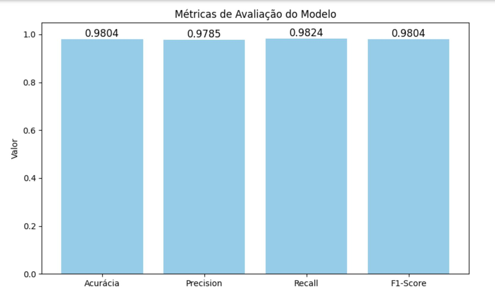
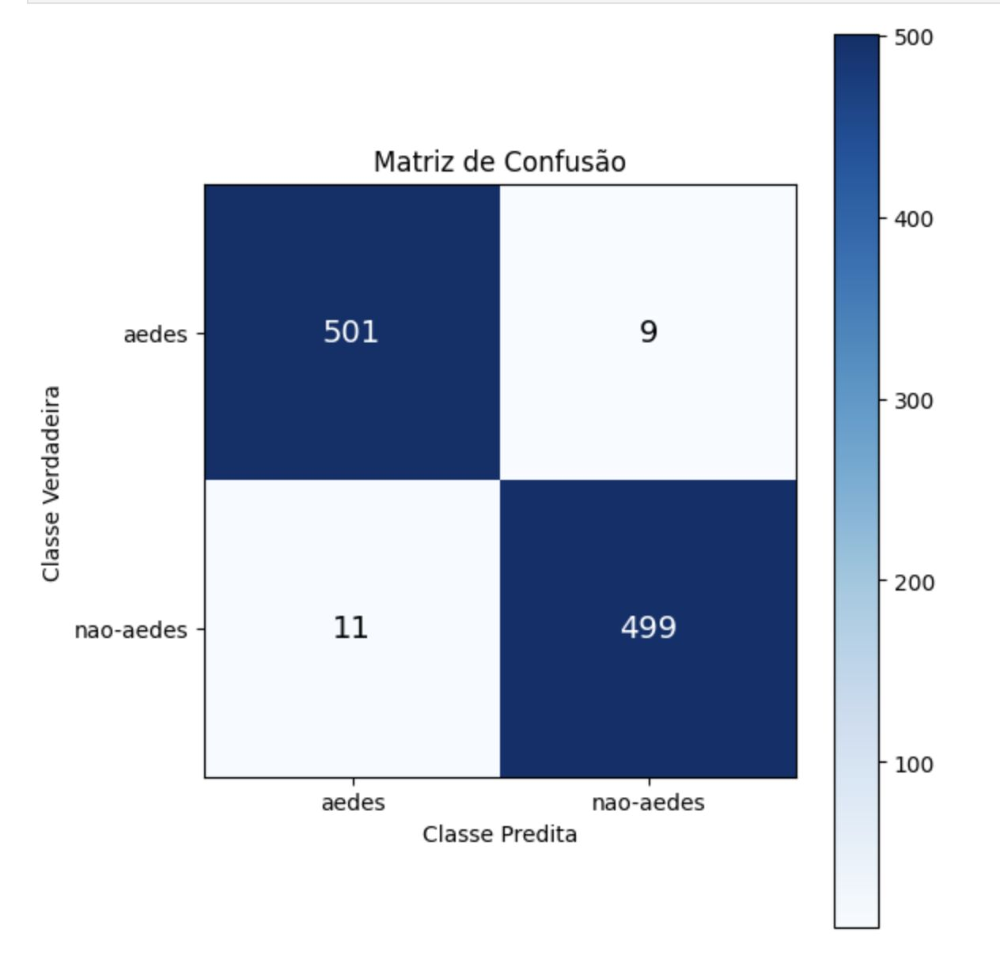
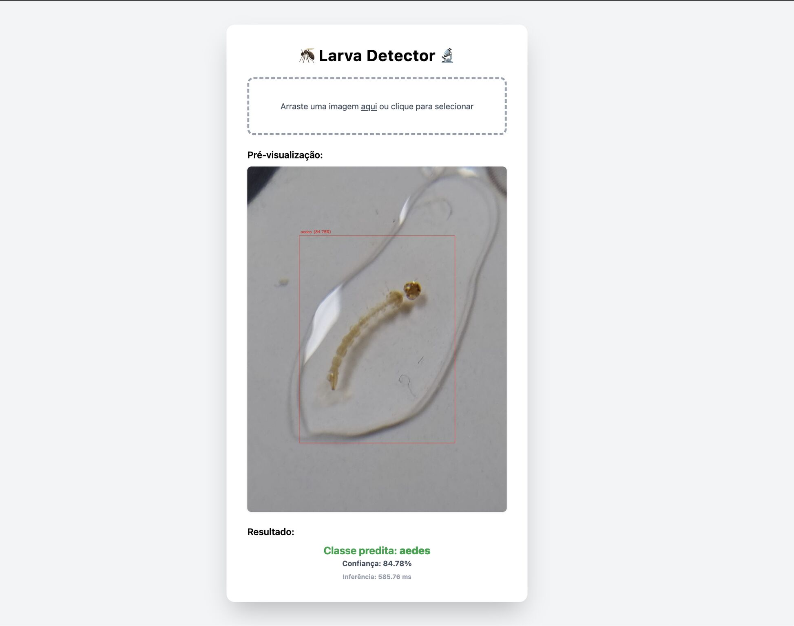

# 📦 EfficientNetB4 • ONNX • Flask API

> Documentação explicativa do pipeline de classificação de imagens  
> Treinamento → Exportação ONNX → Serviço via Flask

---

## 1. Introdução

Este repositório implementa um fluxo completo de **classificação de imagens** usando:

- **EfficientNetB4** como backbone de CNN  
- **Exportação para ONNX** para inferência ultrarrápida  
- **Flask API** para disponibilizar o modelo em produção  

Tudo pensado para entregar um serviço de inferência leve, escalável e fácil de integrar.

---

## 2. Pré-requisitos

- Python 3.8+
- ONNX 1.10+  
- Flask 2.x

## 3. Métricas de Desempenho

1. **Loss & Accuracy ao longo das épocas**  
   

2. **Curva ROC / Precision-Recall**  
   

---

## 4. Exemplo de Inferência

